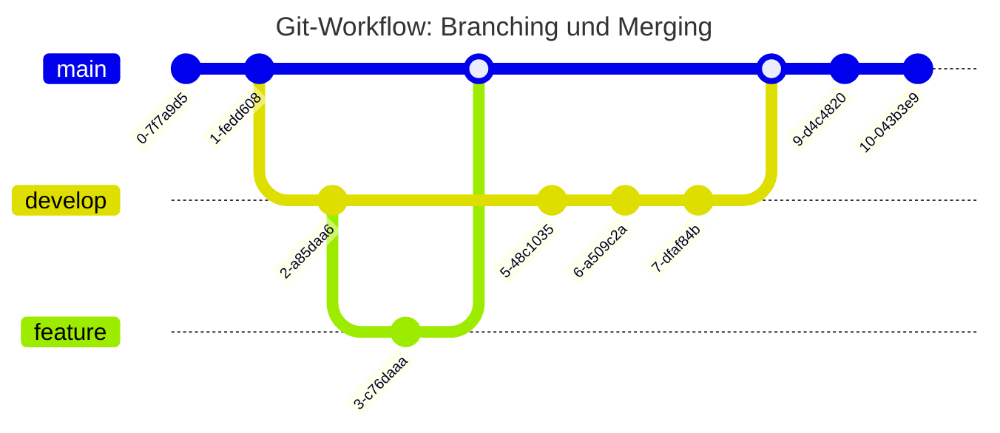

<!--

author:   Volker Göhler
email:    volker.goehler@informatik.tu-freiberg.de
version:  0.0.4
language: de
narrator: Deutsch Female

edit: true
date: 2026-05-07

icon: img/TUBAF_Logo_blau.png
comment:  Übung Softwareentwicklung 03

import: https://raw.githubusercontent.com/liaScript/mermaid_template/master/README.md
import: https://raw.githubusercontent.com/liascript-templates/plantUML/master/README.md

link:   https://raw.githubusercontent.com/vgoehler/LiaScript_CSS_Provider/refs/heads/main/dist/university.css

tags: [ Sommersemester2026, Softwareentwicklung, Übung03]

-->

[](https://liascript.github.io/course/?https://raw.githubusercontent.com/Ifi-Softwareentwicklung-SoSe2026/exercise_03/refs/heads/main/README.md)

#  Aufgabe 03

Softwareentwicklung SoSe2026
============================

Bearbeitungszeitraum
====================

*17. Mai - 30. Mai 2026*

## Offene Fragen aus Aufgabe 02

Die folgenden Aufgaben aus der letzten Einheit (Aufgabe 02) sollten bearbeitet worden sein:

Aufgabe 1: Klassenhierarchie für Himmelskörper
--------------------

- [ ] Wurde eine abstrakte Basisklasse `Himmelskoerper` erstellt?
- [ ] Wurden die Klassen `Stern`, `Planet` und `Mond` von `Himmelskoerper` abgeleitet?
- [ ] Wurden Constructor-Chaining mit `base()` verwendet?
- [ ] Wurde `ToString()` in den abgeleiteten Klassen überschrieben?

Aufgabe 2: Bahndaten (Immutable DataBean)
--------------------

- [ ] Wurde eine immutable Klasse `Bahndaten` mit `init;`-Properties erstellt?
- [ ] Wurden `ToString()` und `GetHashCode()` implementiert?

Aufgabe 3: Speichervisualisierung
--------------------

- [ ] Wurde eine statische Klasse `SpeicherVisualisierer` mit `params object[]` erstellt?
- [ ] Wird für jedes Objekt Typ, Wert und HashCode ausgegeben?

Aufgabe 4: Bahnvisualisierung (ASCII)
--------------------

- [ ] Wurde eine Klasse `BahnVisualisierer` erstellt, die von `BahnBasic` erbt?
- [ ] Wird die Bahn eines Himmelskörpers als ASCII-Diagramm gezeichnet?
- [ ] Wird die Exzentrizität der Bahn berücksichtigt?

## Neue Aufgaben für diese Woche

Wir erweitern die Raumfahrt-Mission um Konzepte der **Schnittstellenprogrammierung**, **generische Kollektionen** und den **Umgang mit Dateien**. Zudem üben wir die **kollaborative Arbeit mit Git und GitHub**.

### **📌 Vorbereitung: Projekt aktualisieren**

1. Nutze das bestehende **C#-Konsolenprojekt** `RaumfahrtMission` aus Aufgabe 02.
2. Füge die finalen Klassen aus Aufgabe 02 hinzu (falls noch nicht vorhanden), die Version aus `solutions` im `exercise_02` Repo kann als Ausgangspunkt genutzt werden.
3. Alle Klassen sollen weiterhin im Namespace **`RaumfahrtMission`** liegen.

### **🛠️ Aufgabe 0: Git und GitHub kennenlernen**

*Lernziele: Commits, Branches, Push/Pull, Pull Requests, Code Review mit GitHub*

---

#### **📝 Aufgabenstellung**

Git und GitHub haben zwei Dimensionen, die du in dieser Aufgabe beide kennenlernen sollst:

| Dimension | Werkzeuge & Features |
|-----------|----------------------|
| **Lokal** (Visual Studio Code + Git) | Repository klonen (`clone`), Änderungen vormerken (`add`/`stage`), committen (`commit`), Branches erstellen und wechseln (`branch`, `checkout`/`switch`), Änderungen zusammenführen (`merge`), Konflikte lösen, Git-Integration in VS Code (Source-Control-Panel) |
| **Remote** (GitHub) | Änderungen hochladen (`push`) und herunterladen (`pull`/`fetch`), Pull Requests erstellen und reviewen, Issues anlegen und verfolgen, Code Review durch Copilot anfordern (GitHub Copilot Code Review), PR-Feedback von Lehrenden oder Agenten einarbeiten |

---

#### **🔧 Lokale Git-Arbeit mit Visual Studio Code**

1. **Repository klonen**

   - Öffne VS Code und klone dein GitHub-Classroom-Repository über *Source Control → Clone Repository* (Erscheint nur in einem leeren Fenster).
   - Alternativ im Terminal: `git clone <URL>`

2. **Feature-Branch erstellen**

   - Erstelle für jede Aufgabe einen eigenen Branch, z. B.:

     ```bash
     git switch -c feature/aufgabe-1-interfaces
     # -c steht für "create" – erstellt den Branch und wechselt sofort dorthin
     # Alternativ (ältere Syntax): git checkout -b feature/aufgabe-1-interfaces
     ```

   - Das hält den `main`-Branch sauber und ermöglicht später einen sauberen Pull Request.



3. **Änderungen committen**

   - Nutze aussagekräftige Commit-Nachrichten:

     ```bash
     git status                                        # Überblick: welche Dateien sind geändert?
     git add Himmelskoerper.cs IMissionsobjekt.cs      # gezielt einzelne Dateien vormerken
     git commit -m "feat: IMissionsobjekt Interface hinzugefügt"
     ```

   - Oder verwende das **Source Control Panel** in VS Code (Strg+Shift+G).

4. **Änderungen pushen**

   ```bash
   git push origin feature/aufgabe-1-interfaces
   ```

---

#### **🌐 Remote-Arbeit mit GitHub**

1. **Pull Request erstellen**

   - Öffne das Repository auf GitHub.
   - Klicke auf *Compare & pull request* für deinen Branch.
   - Beschreibe deine Änderungen im PR und wähle `main` als Zielbranch.

2. **Code Review von Copilot anfordern**

   - Im Pull Request: Klicke auf *Reviewers* → wähle **Copilot** aus.
   - Copilot analysiert deinen Code und gibt automatisch Feedback.
   - Arbeite das Feedback ein (neue Commits im selben Branch) und markiere Kommentare als erledigt.

3. **PR von Lehrenden reviewen**

   - Dein Lehrender oder ein Agent kann ebenfalls einen Review hinterlassen.
   - Lies die Kommentare, beantworte Fragen und passe deinen Code an.
   - Nach Freigabe wird der PR in `main` gemergt.

4. **Issues nutzen**

   - Erstelle ein Issue für einen Fehler oder eine Frage, z. B. *"Frage: Wie implementiere ich IEnumerable<T> korrekt?"*
   - Verweise in Commit-Nachrichten auf Issues: `fix: Validierung korrigiert, closes #3`

5. **Änderungen pullen**

   - Halte deinen lokalen `main`-Branch aktuell:

     ```bash
     git switch main
     git pull origin main
     ```

#### Aufgabenliste

1. Clone dein Repository 

   - im Classroom die Aufgabe annehmen
   - im Repository die URL kopieren (grüner Button "Code")
   - im Terminal: `git clone <URL>` oder in VS Code: *Source Control → Clone Repository*
   - Wechsle in das geklonte Verzeichnis: `cd <repository-name>`

2. Erstelle einen Branch `integration`
3. Schau im Issue-Tracker auf GitHub, ob es offene Issues gibt, und wähle eines aus, das du bearbeiten möchtest.
4. Prüfe mit `git status`, welche Dateien unverändert bzw. geändert sind, Füge diese mit `git add <Dateiname>` oder `git add .` (für alle) zur Staging-Area hinzu.
5. Committe die Änderungen mit einer aussagekräftigen Nachricht.
6. Push den Branch und erstelle einen Pull Request auf GitHub (`Closes #IssueNumber` ist wichtig damit der Issue automatisch geschlossen wird)
7. Warte auf den Code Review und arbeite das Feedback ein
8. Merge den PR nach Freigabe nach `main`. Falls die Freigabe nicht erteilt wird, arbeite weiter am Branch und pushe neue Commits, bis der PR freigegeben wird.

